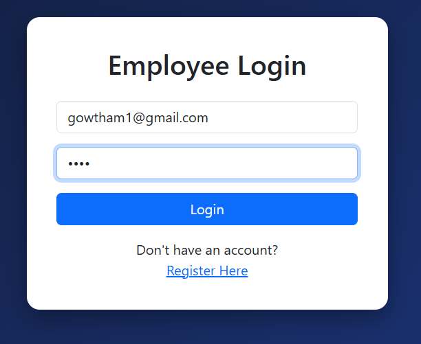
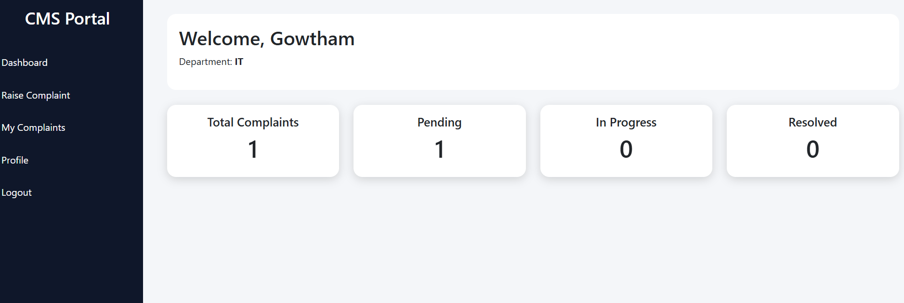
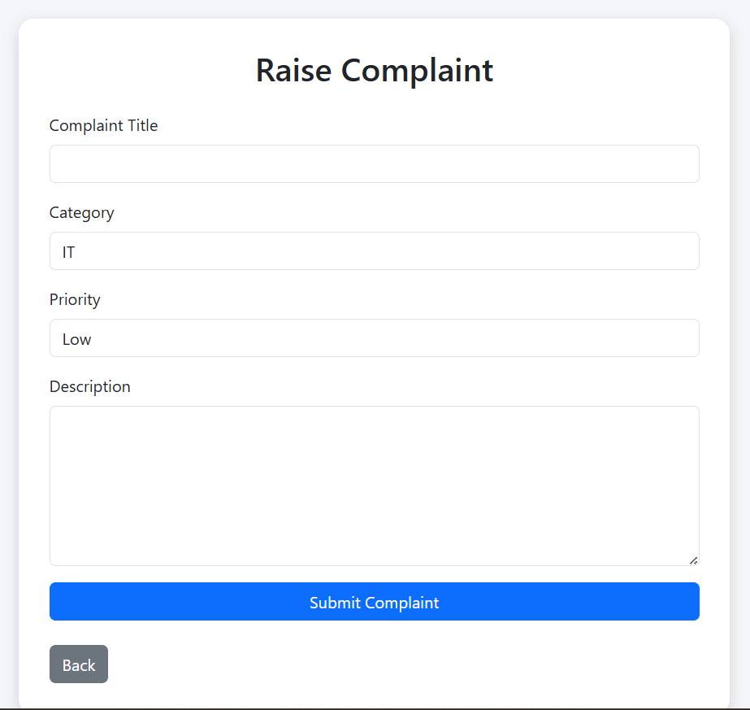
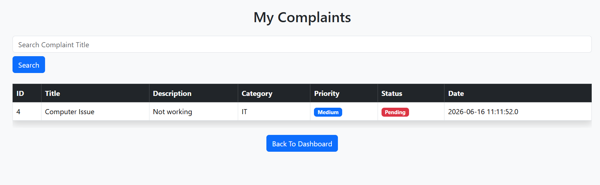
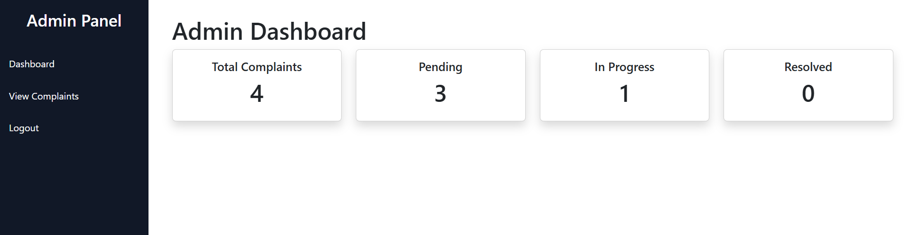
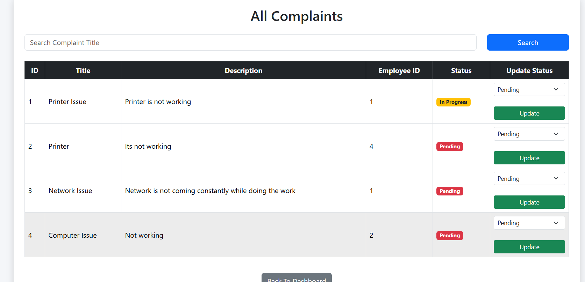

# 📝 Complaint Management System

## 📌 Project Overview

The Complaint Management System is a web-based application developed using Java, JSP, Servlets, JDBC, MySQL, HTML, CSS, and Bootstrap. It provides a centralized platform where employees can register complaints and track their status, while administrators can manage, monitor, and resolve complaints efficiently.

---

## 🎯 Aim

To develop a complaint handling system that streamlines complaint registration, tracking, and resolution, improving communication between employees and administrators.

---

## 🧠 Technologies Used

### Backend

* Java
* JSP
* Servlets
* JDBC

### Frontend

* HTML5
* CSS3
* Bootstrap 5

### Database

* MySQL

### Server

* Apache Tomcat 11

### Tools

* Eclipse IDE
* VS Code
* Git
* GitHub

---

## ✨ Features

### 👨‍💼 Employee Module

* Employee Registration
* Employee Login & Logout
* Employee Dashboard
* Raise Complaints
* View Personal Complaints
* Search Complaints
* Profile Management
* Complaint Status Tracking

### 🛡️ Admin Module

* Admin Login & Logout
* Admin Dashboard
* View All Complaints
* Search Complaints
* Update Complaint Status
* Complaint Monitoring
* Dashboard Statistics

### 📋 Complaint Management

* Complaint Categories
* Complaint Priorities
* Status Tracking
* Search & Filter Functionality
* Real-Time Complaint Updates

---

## ⚙️ Project Workflow

### Employee Side

1. Register Account
2. Login
3. Access Dashboard
4. Raise Complaint
5. Track Complaint Status
6. View Complaint History
7. Logout

### Admin Side

1. Login
2. View Dashboard Statistics
3. Monitor Complaints
4. Search Complaints
5. Update Complaint Status
6. Resolve Complaints
7. Logout

---

## 📊 Dashboard Statistics

The Admin Dashboard displays:

* Total Complaints
* Pending Complaints
* In Progress Complaints
* Resolved Complaints

Statistics are dynamically fetched from the database.

---

## 📁 Project Structure

ComplaintManagementSystem
│
├── src
│   └── main
│       │
│       ├── java
│       │   └── com.cms
│       │       │
│       │       ├── dao
│       │       │   ├── AdminDAO.java
│       │       │   ├── ComplaintDAO.java
│       │       │   └── EmployeeDAO.java
│       │       │
│       │       ├── dto
│       │       │   ├── Admin.java
│       │       │   ├── Complaint.java
│       │       │   └── Employee.java
│       │       │
│       │       ├── servlet
│       │       │   ├── AdminDashboardServlet.java
│       │       │   ├── AdminLoginServlet.java
│       │       │   ├── AdminLogoutServlet.java
│       │       │   ├── AdminSearchComplaintServlet.java
│       │       │   ├── DashboardServlet.java
│       │       │   ├── EmployeeSearchComplaintServlet.java
│       │       │   ├── LoginServlet.java
│       │       │   ├── LogoutServlet.java
│       │       │   ├── RaiseComplaintServlet.java
│       │       │   ├── RegisterServlet.java
│       │       │   ├── SearchComplaintServlet.java
│       │       │   ├── UpdateStatusServlet.java
│       │       │   ├── ViewAllComplaintsServlet.java
│       │       │   └── ViewComplaintsServlet.java
│       │       │
│       │       └── util
│       │           └── DBConnection.java
│       │
│       └── webapp
│           │
│           ├── css
│           │   └── style.css
│           │
│           ├── images
│           │   └── logo.png
│           │
│           ├── WEB-INF
│           │   └── web.xml
│           │
│           ├── adminDashboard.jsp
│           ├── adminLogin.jsp
│           ├── complaintSuccess.jsp
│           ├── dashboard.jsp
│           ├── error.jsp
│           ├── index.jsp
│           ├── login.jsp
│           ├── profile.jsp
│           ├── raiseComplaint.jsp
│           ├── register.jsp
│           ├── success.jsp
│           ├── updateStatus.jsp
│           ├── viewAllComplaints.jsp
│           └── viewComplaints.jsp
│
├── target
├── .gitignore
├── pom.xml
└── README.md
---

## 🗄️ Database Tables

### Employee Table

* Employee ID
* Name
* Email
* Password
* Department

### Complaint Table

* Complaint ID
* Title
* Description
* Category
* Priority
* Status
* Employee ID
* Created Date

---

## 🚀 How to Run the Project

### 🔹 Step 1: Clone Repository

git clone https://github.com/gowtham0799/ComplaintManagementSystem.git

### 🔹 Step 2: Configure MySQL Database

Create database and tables in MySQL.

### 🔹 Step 3: Update Database Credentials

Modify database configuration inside:

DBConnection.java

### 🔹 Step 4: Build Project

mvn clean install

### 🔹 Step 5: Deploy on Tomcat

Deploy the generated WAR file to Apache Tomcat.

### 🔹 Step 6: Run Application

http://localhost:8080/ComplaintManagementSystem/

---

## 📷 Screenshots

### Employee Login

### Employee Dashboard

### Raise Complaint

### My Complaints

### Admin Dashboard

### Manage Complaints

---

## 🔒 Security Features

* Session-Based Authentication
* Login Validation
* Protected Pages
* Role-Based Access Control
* Secure Logout

---

## 🚀 Future Enhancements

* Email Notifications
* OTP-Based Password Recovery
* Complaint Attachments
* PDF Report Generation
* Advanced Complaint Analytics
* REST API Integration
* Cloud Deployment
* Mobile Application Support

---

## 📌 Conclusion

The Complaint Management System demonstrates the implementation of a full-stack Java web application using MVC architecture. It provides an efficient solution for complaint registration, tracking, and resolution while offering practical exposure to Java EE technologies and database management.

---

## 👨‍💻 Author

**Gowtham Vijay Sai Mamillapalli**

